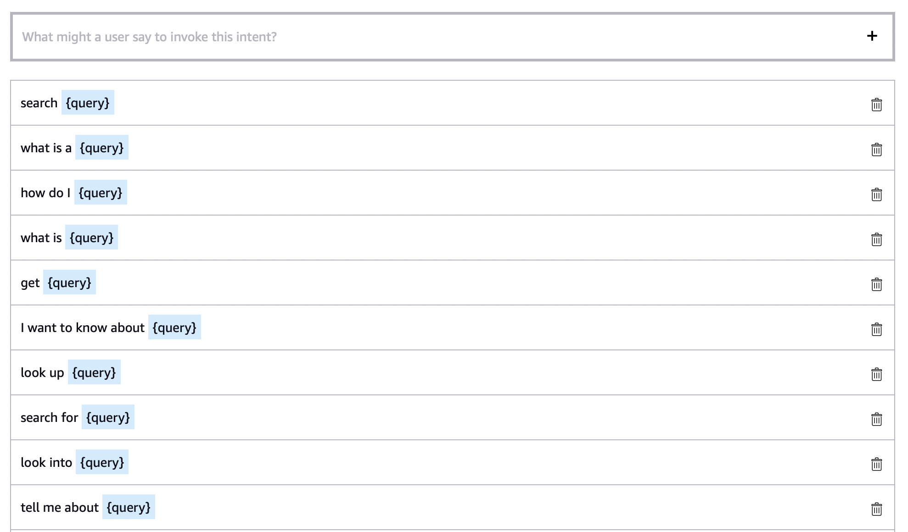

# Module 2: Configuring Amazon Kendra 

You should already be able to query your index in the Amazon Kendra console. To query it from your skill, however, requires some additional set up. Start by allowing your skill to interact with Amazon Kendra.

## Adding permissions

Before you call Amazon Kendra from the Alexa Skills Console, you need to add permissions. 

1. In your Skills Console, go to the **Code** tab and find the **Integrate** button along the top bar. Copy the **Role ARN**.

1. Go to the [AWS Management Console](https://console.aws.amazon.com/console/home?region=us-east-1) and navigate to the **IAM** page. Go to **Roles** on the left sidebar, and then select the **Create role** button. Choose **AWS Service** under **Select type of trusted entity**, and then **Lambda** under **Common use cases**. Select **Next: Permissions**.

1. On the next page, use the search bar to find the **AmazonKendraFullAccess** policy and select it. Choose **Next: Tags** and then **Next: Review**. Create a name for your role, and then create your role. 

1. Go back to the **Roles** page and select the role you just made. Select the **Trust relationships** tab and then **Edit trust relationship**. Find the line that says `"Service"`, add a comma at the end of it, press enter to go to a new line, and paste in this line.

```
"AWS": "<Replace with AWS Lambda Execution Role ARN from Alexa-hosted skill>"
```

5. Paste the Role ARN you copied from the Skills Console where it says `<Replace with AWS Lambda Execution Role ARN from Alexa-hosted skill>`.

The full trust relationship should now look like this.

```
{
  "Version": "2012-10-17",
  "Statement": [
    {
      "Effect": "Allow",
      "Principal": {
        "Service": "lambda.amazonaws.com",
        "AWS": "<Replace with AWS Lambda Execution Role ARN from Alexa-hosted skill>"
      },
      "Action": "sts:AssumeRole"
    }
  ]
}
```

6. Choose **Update Trust Policy** to save. 
7. On the summary page, find the **Role ARN** and copy and paste it somewhere you can find it later. You will use this to call Amazon Kendra from your skill. 

To learn more about adding permissions, see [Use Personal AWS Resources with Your Alexa-hosted Skill](https://developer.amazon.com/en-US/docs/alexa/hosted-skills/alexa-hosted-skills-personal-aws.html).

## Creating Intents and Slots

Next you need to add slots and intents to your model so your skill can handle user requests. Intents are actions that fulfill what the user is trying to do. An utterance, or what the user says, invokes an intent. Slots are parts of an utterance that help your skill determine the intent of an utterance. 

1. Go back to the **Build** tab and select **Intents** under the **Interaction Model** tab. Here you’ll see all of the preset handlers in your skill. 
2. Create a new intent by pressing the **Add Intent** button. Select **Create custom intent**, enter **CaptureQueryIntent** to name your intent, and then press the **Create custom intent** button. 

1. For your sample utterances, think about the different ways someone could ask a question about your documentation. Add each utterance in the text box, replacing the part of the utterance that can be used as an Amazon Kendra query with a slot called **query**. You can do this by typing curly brackets around the word query, like this: **{query}**. Then, press enter twice to save the utterance. 

Below are several examples of sample utterances to add for querying documentation. Keep in mind that while some of these are awkward to read, when spoken, they make more sense. The way a user might ask a question can vary a lot, so it’s important to account for those cases. Note that the only part of the user’s utterance passed to Amazon Kendra is what’s within the query slot. 



4. Next, scroll down to the **Intent Slots** section and find the dropdown menu for **Slot Type** next to your slot. Select **AMAZON.SearchQuery**. This is a built-in slot type that can take less predictable phrases, like varying questions about documents. 

1. Go back to the **Intents** page where all your skill’s intents are listed. Find **HelloWorldIntent** and delete it by selecting **Delete** in the **Actions** column. A prompt asks you to confirm that you want to delete it. Select **Delete Intent** to confirm. 

1. Be sure to press **Save Model** and **Build Model** at the top of the page. In the next step, CaptureQueryIntent is going to replace the HelloWorldIntent you just deleted. 

## Getting a response

After your build is complete, go back to the **Code** tab. Now that you’ve created an intent and a slot, you can access the user’s question to pass to Amazon Kendra. 

1. Find the **HelloWorldIntentHandler** and change the intent name to **CaptureQueryIntentHandler**. Be sure to also update the `is_intent_name` parameter in the return line to `“CaptureQueryIntent”`. 

Find the line `speak_output = "Hello World!"` in the `handler()` function and replace it with this code: 

```
slots = handler_input.request_envelope.request.intent.slots
query = slots["query"].value
```

This is how your skill accesses user input. The query slot you just created will be pulled from the user’s request and used to query Amazon Kendra.

2. Below that, create a variable with your index ID. Amazon Kendra uses this to find your documents. You can find your index ID by selecting your index in the [Amazon Kendra Console.](https://aws.amazon.com/console/) In the **Index Settings** table, copy the **Index ID**, and paste it where it says indexID below.

```
index_id = 'indexID'
```

3. Enter a new line below `index_id`, and add this code to query your index and get a response. The code below is an updated version of the code provided on how to query an index in the [Amazon Kendra documentation.](https://docs.aws.amazon.com/kendra/latest/dg/searching-example.html) 

In the `assumed_role_object` variable, replace `<Your AWS resource role ARN>` with the role ARN you saved in the **Adding permissions** section. You can find again it by going to **Roles** in your IAM Console and selecting the role you created. 

In the `kendra` variable, make sure your `region_name` variable is the same as the one you created your Amazon Kendra index in. You can find this by selecting your index in the Amazon Kendra Console and then selecting the dropdown menu in the top right corner with a location, e.g. N. Virginia. The region name will be listed next to the name of the location. 

```
sts_client = boto3.client('sts')
assumed_role_object = sts_client.assume_role(RoleArn="<Your AWS resource role ARN>", RoleSessionName="AssumeRoleSession1")
credentials = assumed_role_object['Credentials']
        
kendra = boto3.client('kendra', 
            aws_access_key_id = credentials['AccessKeyId'],
            aws_secret_access_key = credentials['SecretAccessKey'],
            aws_session_token = credentials['SessionToken'],
            region_name = 'us-east-1')

response = kendra.query(
    QueryText = query,
    IndexId = index_id)
    
for query_result in response['ResultItems']:

    if query_result['Type']=='ANSWER':
        answer_text = query_result['DocumentExcerpt']['Text']
        speak_output = "I found this: " + answer_text + "." 
        break
        
    if query_result['Type']=='DOCUMENT':
        document_text = query_result['DocumentExcerpt']['Text']
        if 'DocumentTitle' in query_result:
            document_title = query_result['DocumentTitle']['Text']
            speak_output = "I found a document titled " + document_title + "."
        else:
            speak_output = "I found this: " + document_text + "."
        break
```

The code above gets the first query response Amazon Kendra finds, saves the answer text or document title, and creates a `speak_output` variable to reply to the user with that response. The construction of this response should be updated in a way that makes the most sense with your documentation. As you can see, the `speak_output` variable varies between the ANSWER and DOCUMENT query result types. 

**Note:** If you added FAQs to your index, update the line `if query_result['Type']=='ANSWER':` to include the FAQ result type:
```
if (query_result['Type']=='ANSWER' or query_result['Type']=='QUESTION_ANSWER'):
```


Your **CaptureQueryIntentHandler** should now look like this:

```
class CaptureQueryIntentHandler(AbstractRequestHandler):
    """Handler for Query Intent."""
    def can_handle(self, handler_input):
        # type: (HandlerInput) -> bool
        return ask_utils.is_intent_name("CaptureQueryIntent")(handler_input)

    def handle(self, handler_input):
        # type: (HandlerInput) -> Response
        slots = handler_input.request_envelope.request.intent.slots
        query = slots["query"].value
        index_id = 'indexID' # replace with your index ID 
        
        sts_client = boto3.client('sts')
        assumed_role_object=sts_client.assume_role(RoleArn="<Your AWS resource role ARN>",  RoleSessionName="AssumeRoleSession1") # replace with your AWS resource role ARN
        credentials=assumed_role_object['Credentials']
        
        kendra = boto3.client('kendra', 
                        aws_access_key_id=credentials['AccessKeyId'],
                        aws_secret_access_key=credentials['SecretAccessKey'],
                        aws_session_token=credentials['SessionToken'],
                        region_name='us-east-1') # replace with your index region name

        response = kendra.query(
            QueryText = query,
            IndexId = index_id)
            
        for query_result in response['ResultItems']:
            
            if query_result['Type']=='ANSWER':
                answer_text = query_result['DocumentExcerpt']['Text']
                speak_output = "I found this: " + answer_text + "." 
                break
                
            if query_result['Type']=='DOCUMENT':
                document_text = query_result['DocumentExcerpt']['Text']
                if 'DocumentTitle' in query_result:
                    document_title = query_result['DocumentTitle']['Text']
                    speak_output = "I found a document titled " + document_title + "."
                else:
                    speak_output = "I found this: " + document_text + "."
                break

        return (
            handler_input.response_builder
                .speak(speak_output)
                # .ask("add a reprompt if you want to keep the session open for the user to respond")
                .response
        )
```

4. Now scroll back to the top of your **lambda_function.py** file and find the line `import ask_sdk_core.utils as ask_utils`. Below it, paste in this line:

```
import boto3
```

This enables you to access to the boto3 client to call Amazon Kendra.

5. You also need to update Boto3 to the most recent version. Go to the [Boto3 Documentation](https://boto3.amazonaws.com/v1/documentation/api/latest/index.html#) and find the version number in the upper left corner. Go back to the console, and in the left sidebar, select the **requirements.txt** file. The first line should be **boto3==1.9.216**. Replace the version number on the right side of the equal signs with the current version number you copied from the Boto3 documentation. Press **Save** and then go back to your **lambda_function.py** file.
2. Lastly, scroll to the bottom of the file, and replace `sb.add_request_handler(HelloWorldIntentHandler())` with `sb.add_request_handler(CaptureQueryIntentHandler())` to register the handler with the right name. 
3. Save and deploy your code, and then go to the **Test** tab. Open your skill and ask a question that can be found in your index. If you get a response, you’ve successfully queried your Amazon Kendra index with an Alexa Skill.

<a href="#" class="button big">[Continue to Module 2](https://github.com/alexa-samples/amazon-kendra-skill-sample-python/tree/main/Module-3)</a>
