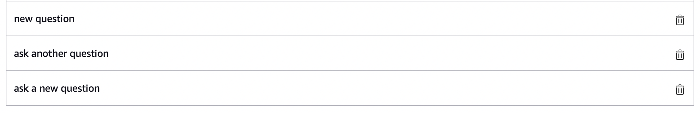

# Module 3: Finding the right response

Now that you can query Amazon Kendra with your skill, implement features that prompt a natural conversation and enhanced user experience. 

The goal of this skill is providing the user with the answer they are looking for in your index. If the first response is not what they were looking for, your skill should try to get the right information. Amazon Kendra automatically returns ordered responses based on relevance, so your skill can offer the second and third query responses if the user is unsatisfied with the first and second, since the first few should be relevant. 

Before searching for more responses, you need to set up dialogue for multi-turn conversation so the user can ask for another response. Edit the `speak_output` variables in your **CaptureQueryIntentHandler** to prompt the user to reply whether or not their question was answered. Be sure to change it in both `if` statements, as seen below.
```
for query_result in response['ResultItems']:

    if query_result['Type']=='ANSWER':
        answer_text = query_result['DocumentExcerpt']['Text']
        speak_output = "I found this: " + answer_text + ". Is this what you were looking for?"  
        break
        
    if query_result['Type']=='DOCUMENT':
        document_text = query_result['DocumentExcerpt']['Text']
        if 'DocumentTitle' in query_result:
            document_title = query_result['DocumentTitle']['Text']
            speak_output = "I found a document titled " + document_title + ". Is this what you were looking for?"  
        else:
            speak_output = "I found this: " + document_text + ". Is this what you were looking for?"  
        break
```

Note that the text in the `speak_output` variables provided here are good examples, but they can (and should) be changed if a different flow or tone makes more sense for your documentation. 

The updated outputs ask a yes or no question, so you need an intent handler that a) is triggered by a “yes” or a “no” and b) takes the appropriate action based on the user’s reply and what question the user is answering. This will become more important as more intents are added and more yes or no questions arise. 

Don’t forget to save your code periodically, especially when navigating to a new page.

## “Yes” and “No” Intent Handler

Just like the first handler you built, you’ll need to create a new intent to trigger the handler on the backend. 

1. On the **Build** page, add a new intent, but this time choose **Use an existing intent from Alexa's built-in library**. In the search bar, type “Yes” to find the **AMAZON.YesIntent** and select **Add Intent**. Do the same for **AMAZON.NoIntent**. Your Intents list should now include these two built-in intents. 
2. Save and build your updated model.
3. Go back to the **Code** page. This time you’ll need to add in a new handler. Find the **HelpIntentHandler**, create a new line above it, and copy and paste this code so it’s between **CaptureQueryIntentHandler** and **HelpIntentHandler**.

```
class YesNoIntentHandler(AbstractRequestHandler):
    """Handler for Yes or No Intent."""
    def can_handle(self, handler_input):
        # type: (HandlerInput) -> bool
        return (ask_utils.is_intent_name("AMAZON.YesIntent")(handler_input) or
                ask_utils.is_intent_name("AMAZON.NoIntent")(handler_input))

    def handle(self, handler_input):
        # type: (HandlerInput) -> Response
        yes = ask_utils.is_intent_name("AMAZON.YesIntent")(handler_input)
        no = ask_utils.is_intent_name("AMAZON.NoIntent")(handler_input)
        
        if yes:
            speak_output = "Great! You found the answer you were looking for."
            return (
                handler_input.response_builder
                    .speak(speak_output)
                    .response
            )
                    
        if no:
            return CaptureQueryIntentHandler().handle(handler_input)
```

Note the return line in the `can_handle()` function. Because this handler is triggered by yes OR no, both intents must be included. 

These intents are used to create the `yes` and `no` variables, so the handler can do different things when the user says “yes” or “no” as seen in the subsequent `if` statements. Different outputs are generated based on whether the user says yes or no.

4. Make sure to register the new handler at the bottom of the file. Find `sb.add_request_handler(CaptureQueryIntentHandler())`, enter a new line below it, and add this line: 
```
sb.add_request_handler(YesNoIntentHandler())
```

There are two scenarios you need to account for in this handler. The first is if the user replies yes to the question “Is that what you were looking for?” In this case, you’ll need to decide what you want the skill to do or say next. 

The second scenario is if the user replies no to the question. In the code above, CaptureQueryIntentHandler is automatically triggered so your skill queries the Amazon Kendra index again. Then, your skill should output the second Amazon Kendra response to the user’s query. Continue to next section to implement this functionality.

## Tracking queries with session attributes

You can use session attributes to get the next query response when the user says no. Session attributes map key/value pairs where you can store data that lasts throughout the session. 

1. Go to the **LaunchRequestHandler**. In the **handle()** function, enter a line below `reprompt_text` and paste the following code to create session attributes:

```
session_attr = handler_input.attributes_manager.session_attributes
session_attr["LastQuery"] = "no previous query"
session_attr["QueryStatus"] = "none asked"
session_attr["QueryCount"] = 0
```

You can create new session attributes by using square brackets to set values, as seen above. These attributes will be used to track the status of a query. 

2. Now go back to the **YesNoIntentHandler**. You can use the attributes you just created to track if a query was answered or if another attempt should be made to answer a user’s question. Find the yes and no variables you created, and paste this line above them:

```
session_attr = handler_input.attributes_manager.session_attributes
```

Every time you want to use session attributes in a handler, you need to call the attribute manager again. This enables you to access any session attributes that have been set. 

3. Find the `if no:` statement, enter a new line below it, and paste this in above the return line:

```
session_attr["QueryStatus"] = "asked not answered"
```

4. Now go to **CaptureQueryIntentHandler**. Enter a new line above the line `slots = handler_input.request_envelope.request.intent.slots` and paste this in to get the session attributes for this handler:
```
session_attr = handler_input.attributes_manager.session_attributes
```

5. Find `query = slots["query"].value`, enter a new line below it, and paste this code in: 
```
if session_attr["QueryCount"] > 2:
    speak_output = "I'm having trouble finding information on your question. Please try asking it another way."
    session_attr["QueryCount"] = 0
    session_attr["QueryStatus"] = "new ask"
    return (
        handler_input.response_builder
            .speak(speak_output)
            .response
    )
```

The `if` statement is how your skill tracks how many times it’s tried to answer the same query. After three attempts, it will prompt the user to try asking another way and reset the `QueryCount` and `QueryStatus`  attributes. 

6. Next, find the `for` loop that iterates through Amazon Kendra query responses. Enter a new line after `for query_result in response['ResultItems']:`  and copy and paste this code in:

```
if session_attr["QueryStatus"] == "asked not answered": 
    session_attr["QueryStatus"] = "new pass"
    session_attr["QueryCount"] += 1
    continue
       
if session_attr["QueryCount"] == 2:
    session_attr["QueryCount"] += 1
    continue
```

This code tracks how many times the same query is passed to Amazon Kendra. It gets the second and third query responses when the same question is asked a second and third time, updating the session attributes accordingly so CaptureQueryIntentHandler and YesNoIntentHandler can communicate and the appropriate responses are returned to the user.

7. Now go to the bottom of CaptureQueryIntentHandler, and above the return line, paste this line:

```
session_attr["LastQuery"] = query
```

This attribute will save the most recent query every time the user asks a question.

8. You’ll need to access the user’s last query in this handler, so create a variable that stores it. At the top of the handler, below the line starting with `session_attr =`, paste this in: 

```
last_query = session_attr["LastQuery"]
```

9. Finally, find the line `query = slots["query"].value` and replace it with this: 

```
if session_attr["QueryStatus"] == "asked not answered":
    query = last_query
else:
    query = slots["query"].value
```

Now, when `QueryStatus` is set to “asked not answered” in YesNoIntentHandler, the user’s previous query is used to get an Amazon Kendra response, so the second and third answers can be returned to the user. 

10. As always, save and deploy your code before testing. After Alexa responds to your query, reply with “yes” and “no” to see if your skill responds correctly. 

When you say no after the first query response, you should get a new answer. After saying no twice and getting a third response, your skill should ask you rephrase the question to try again.

**Note**: If you reply to your skill and don’t get a response, it’s likely due to an issue with how long the session stays open. If you are having this problem, add `.set_should_end_session(False)` to ***each*** return line in **CaptureQueryIntentHandler** and **YesNoIntentHandler** to keep the session running. See an example below. 
```
return (
    handler_input.response_builder
        .speak(speak_output)
        .set_should_end_session(False)
        .response
)
```

## Asking another question

For now, when the user’s question is answered, the skill simply tells them that their question has been answered. What if the user wants to ask another question? In this case, CaptureQueryIntentHandler should be triggered again, and the user should be prompted to ask a new question.

1. Go to your **CaptureQueryIntent** on the **Build** page. Add a few new utterances that have to do with asking another question, so that the handler will get triggered by that request. Below are some ideas.



2. Save and build your model.

2. On the **Code** page, go to the `if yes:` statement in the **YesNoIntentHandler** and replace the line starting with `speak_output =` with this code:

```
speak_output = "Great. If you have another question, you can say 'ask another question'."
session_attr["QueryStatus"] = "asked and answered"
session_attr["QueryCount"] = 0
```

Now, after the user’s question is answered, Alexa prompts them to ask another if they want. The `QueryStatus` is updated and the `QueryCount` gets set to 0 in case it hasn’t been reset yet. 

Your **YesNoIntentHandler** should look like this: 

```
class YesNoIntentHandler(AbstractRequestHandler):
    """Handler for Yes or No Intent."""
    def can_handle(self, handler_input):
        # type: (HandlerInput) -> bool
        return (ask_utils.is_intent_name("AMAZON.YesIntent")(handler_input) or
                ask_utils.is_intent_name("AMAZON.NoIntent")(handler_input))

    def handle(self, handler_input):
        # type: (HandlerInput) -> Response
        session_attr = handler_input.attributes_manager.session_attributes
        
        yes = ask_utils.is_intent_name("AMAZON.YesIntent")(handler_input)
        no = ask_utils.is_intent_name("AMAZON.NoIntent")(handler_input)
        
        if yes:
            speak_output = "Great. If you have another question, you can say 'ask another question'."
            session_attr["QueryStatus"] = "asked and answered"
            session_attr["QueryCount"] = 0
            return (
                handler_input.response_builder
                    .speak(speak_output)
                    .response
            )
                    
        if no:
            session_attr["QueryStatus"] = "asked not answered"
            return CaptureQueryIntentHandler().handle(handler_input)
```

If you had to add the `.set_should_end_session(False)` line to your other handlers, make sure to add it here as well. 

4. Go to **CaptureQueryIntentHandler**, enter a new line above `if session_attr["QueryCount"] > 2:` and paste this code in. Again, if you’ve been adding `.set_should_end_session(False)` to the return lines of your handlers, add it below as well. 
```
if (session_attr["QueryStatus"] == "asked and answered" or query is None):
    speak_output = "You just asked about" + " " + last_query + ". What are you looking for now?"
    session_attr["QueryStatus"] = "new ask"
    return (
        handler_input.response_builder
            .speak(speak_output)
            .response
    )
```

This checks the session attribute `QueryStatus` to see if the user is trying to ask a new question. Your skill will include the last query in the response to remind the user what they just asked, and then prompt them to ask their next question. If the user says “ask another question” at any other point during the interaction, the `query is None` condition will trigger this response as well, so the user can then ask their question.

5. Lastly, find the line `if (session_attr["QueryStatus"] == "asked and answered" or query is None):` and enter a new line above it. Paste this code in:

```
if query != last_query:
    session_attr["QueryCount"] = 0
    session_attr["QueryStatus"] = "new ask"
```

This `if` statement will prevent your skill from skipping Amazon Kendra responses if the user asks a new question.

Your **CaptureQueryIntentHandler** should now look like this:

```
class CaptureQueryIntentHandler(AbstractRequestHandler):
    """Handler for Query Intent."""
    def can_handle(self, handler_input):
        # type: (HandlerInput) -> bool
        return ask_utils.is_intent_name("CaptureQueryIntent")(handler_input)

    def handle(self, handler_input):
        # type: (HandlerInput) -> Response
        session_attr = handler_input.attributes_manager.session_attributes
        last_query = session_attr["LastQuery"]
        
        slots = handler_input.request_envelope.request.intent.slots
        if session_attr["QueryStatus"] == "asked not answered":
            query = last_query
        else:
            query = slots["query"].value
            
        if query != last_query:
            session_attr["QueryCount"] = 0
            session_attr["QueryStatus"] = "new ask"
        
        if (session_attr["QueryStatus"] == "asked and answered" or query is None):
            speak_output = "You just asked about" + " " + last_query + ". What are you looking for now?"
            session_attr["QueryStatus"] = "new ask"
            return (
                handler_input.response_builder
                    .speak(speak_output)
                    .response
            )
        
        if session_attr["QueryCount"] > 2:
            speak_output = "I'm having trouble finding information on your question. Please try asking it another way."
            session_attr["QueryCount"] = 0
            session_attr["QueryStatus"] = "new ask"
            return (
                handler_input.response_builder
                    .speak(speak_output)
                    .response
            )
        
        index_id = 'indexID' # replace with your index ID 

        sts_client = boto3.client('sts')
        assumed_role_object=sts_client.assume_role(RoleArn="<Your AWS resource role ARN>", RoleSessionName="AssumeRoleSession1") # replace with your AWS resource role ARN
        credentials=assumed_role_object['Credentials']
        
        kendra = boto3.client('kendra', 
                        aws_access_key_id=credentials['AccessKeyId'],
                        aws_secret_access_key=credentials['SecretAccessKey'],
                        aws_session_token=credentials['SessionToken'],
                        region_name='us-east-1') # replace with your index region name
        
        response = kendra.query(
            QueryText = query,
            IndexId = index_id)
        
        for query_result in response['ResultItems']:
            
            if session_attr["QueryStatus"] == "asked not answered": 
                session_attr["QueryStatus"] = "new pass"
                session_attr["QueryCount"] += 1 
                continue

            if session_attr["QueryCount"] == 2:
                session_attr["QueryCount"] += 1
                continue
            
            if query_result['Type']=='ANSWER': 
                answer_text = query_result['DocumentExcerpt']['Text']
                speak_output = "I found this: " + answer_text + ". Is this what you were looking for?" 
                break
               
            if query_result['Type']=='DOCUMENT':
                document_text = query_result['DocumentExcerpt']['Text']
                if 'DocumentTitle' in query_result:
                    document_title = query_result['DocumentTitle']['Text']
                    speak_output = "I found a document titled " + document_title + ". Is this what you were looking for?"
                else:
                    speak_output = "I found this: " + document_text + ". Is this what you were looking for?"
                break

        session_attr["LastQuery"] = query
        
        return (
            handler_input.response_builder
                .speak(speak_output)
                .response
        )
```

6. Save, deploy, and test your new code. 

    If you say yes after any query response, your skill should offer the option of asking a new question. If you say “ask another question”, Alexa should repeat your last query back to you, and then ask for your new question. 
    
Continue to Module 4
