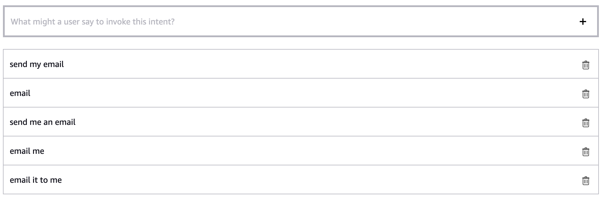

# Module 4: Doing more with your skill

After you are able to query Amazon Kendra and have a multi-turn conversation with Alexa, try implementing some other options for the user when your skill responds to their query. This section isn’t necessary for this skill, but will provide useful features to help the user find a good answer and access resources. 

## ReadDocIntentHandler

When the query response is a document, Alexa simply reads the title of the document before asking if it’s what the user was looking for. While some users will be able to tell from just the title, it might be helpful to hear an excerpt from the document to determine whether or not their question can be answered by the document. 

1. Create a new intent in the **Build** tab called **ReadDocIntent**. For sample utterances, think of the ways a user could ask Alexa to read part of a document. Below are some examples.


Here, you don’t need to create slots since the utterances that can trigger this handler don’t vary much; as long as the user says “read”, the handler will be triggered. 

2. Be sure to save and build your model before going back to the **Code** page. 

3. To access the document text of the last query response, you’ll need to save it in a session attribute when you get the response from Amazon Kendra. The Amazon Kendra code you have so far already saves text from a document in the DOCUMENT response type in the line `document_text = query_result['DocumentExcerpt']['Text']`. In **CaptureQueryIntentHandler**, find that line and add this right below it:
```
session_attr["LastDocText"] = document_text
```

Now you can access that text in another handler. 

4. Create the **ReadDocIntentHandler** for the intent you just created. Paste this code below **CaptureQueryIntentHandler**. Don’t forget to add `.set_should_end_session(False)` if need be.
```
class ReadDocIntentHandler(AbstractRequestHandler):
    """Handler for sending an email"""
    def can_handle(self, handler_input):
        # type: (HandlerInput) -> bool
        return ask_utils.is_intent_name("ReadDocIntent")(handler_input)

    def handle(self, handler_input):
        # type: (HandlerInput) -> Response
        session_attr = handler_input.attributes_manager.session_attributes
        
        doc_text = session_attr["LastDocText"]
        
        speak_output = "Here is an excerpt from the document: " + doc_text + ". Is this what you were looking for?"

        return (
            handler_input.response_builder
                .speak(speak_output)
                .response
        )
``` 

A variable is created to store the `LastDocText` attribute, and then the `speak_output` variable is assigned the text.

5. When listening to the response from this handler, it might be unclear where Alexa starts and stops reading the document excerpt. To make sure the user knows exactly what they’re hearing, you can add a short sound to indicate when Alexa is reading the document excerpt.

If you’d like to implement this feature, replace the `speak_output variable` with this:
```
speak_output = ('Here is an excerpt from the document:'
    '<audio src="soundbank://soundlibrary/musical/amzn_sfx_electronic_beep_03"/>' + doc_text + '.' 
    '<audio src="soundbank://soundlibrary/musical/amzn_sfx_electronic_beep_03"/>'
    'Is this what you were looking for?')
```

The output now includes Speech Synthesis Markup Language (SSML) to add a sound before and after Alexa reads the excerpt. For more information, see [Speech Synthesis Markup Language (SSML) Reference](https://developer.amazon.com/en-US/docs/alexa/custom-skills/speech-synthesis-markup-language-ssml-reference.html#about-ssml), and to see other sounds, see the [Alexa Skills Kit Sound Library](https://developer.amazon.com/en-US/docs/alexa/custom-skills/ask-soundlibrary.html).

6. Register this handler at the bottom of your code. Paste this line below `sb.add_request_handler(CaptureQueryIntentHandler())`:
```
sb.add_request_handler(ReadDocIntentHandler())
```

7. You can prompt the user to trigger this handler by asking them if they want to hear an excerpt when the response is a document title. Go to **CaptureQueryIntentHandler**, and update the `speak_output` variable in the `if 'DocumentTitle' in query_result:` code block only:
```
speak_output = "I found a document titled " + document_title + ". Is this what you were looking for? If you're not sure, you can say 'read me an excerpt'."
```

Now the user is prompted to say “read me an excerpt”, which will trigger the handler. Since you added other variations of that request to your intent, the handler will also be triggered if the user says it slightly differently. 

8. Lastly, update the utterances that trigger YesNoIntentHandler to account for how a user might respond to the output above. After the yes or no question, your skill offers the option of reading the document to the user, which could lead to responses other than “yes” and “no”. If the user doesn’t want to hear the excerpt, the way they respond to the yes or no question might look something like this:

**“That’s not what I was looking for”** or **“That’s the answer I was looking for”**

To make sure your skill properly handles those replies, you can add these and similar utterances to **AMAZON.YesIntent** and **AMAZON.NoIntent**. This way, those responses will trigger YesNoIntentHandler and your skill will take the appropriate course of action. 

Save and deploy your code before going to the **Build** tab. Choose **AMAZON.YesIntent** and **AMAZON.NoIntent** and add sample utterances to represent the various ways a user could say “yes” or “no” to the updated `speak_output`. Don't forget to save and build your model before testing.

9. Test this handler by asking questions until you find a document query response. Your skill should offer the option of reading an excerpt, and when you ask Alexa to do so, your skill should read out the document text. If you say one of the new utterances instead of yes or no, your skill should treat your utterance as a yes or a no response. 

## SendEmailIntentHandler

When the user finds the answer they were looking for, you can give them the option of receiving an email with the query response from Amazon Kendra. To do this, you’ll need to prompt the user to enable permissions so you can access the email associated with their Alexa profile.

### Permissions

1. Create a new intent in the **Build** tab called **SendEmailIntent**. For sample utterances, think of the ways a user could ask Alexa to send them an email. Below are some examples.



2. Save and build your model. 
3. Next, under **Tools** in the left sidebar, select **Permissions**. On the Permissions page, select **Given Name** and **Customer Email Address**. 

If you want to use the user’s full name, you can select that option instead. If there’s another way you want to send the user their answer, like through a text message, you can select other profile information like Customer Phone Number.

4. Go back to the **Code** tab. Below **ReadDocIntentHandler**, paste in this code to create your **SendEmailIntentHandler**. Add `.set_should_end_session(False)` to the return lines if you’ve been doing so in your other handlers.
```
class SendEmailIntentHandler(AbstractRequestHandler):
    """Handler for sending an email"""
    def can_handle(self, handler_input):
        # type: (HandlerInput) -> bool
        return ask_utils.is_intent_name("SendEmailIntent")(handler_input)

    def handle(self, handler_input):
        # type: (HandlerInput) -> Response
        session_attr = handler_input.attributes_manager.session_attributes
        last_query = session_attr["LastQuery"]
        
        service_client = handler_input.service_client_factory.get_ups_service()
        
        try:
            email = service_client.get_profile_email() 
            name = service_client.get_profile_given_name() 
        except:
            return (
                handler_input.response_builder
                    .speak("Please enable first name and email permissions in the Amazon Alexa app.")
                    .set_card(AskForPermissionsConsentCard(permissions=PERMISSIONS))
                    .response
            )
            
        speak_output = "Ok. I'm sending you an email with the documentation about your query, " + last_query + "."
        
        return (
            handler_input.response_builder
                .speak(speak_output)
                .response
        )
```

This code gets user profile information via the [Alexa Service Clients](https://developer.amazon.com/en-US/docs/alexa/alexa-skills-kit-sdk-for-python/call-alexa-service-apis.html#serviceclientfactory) **ServiceClientFactory** and **UpsServiceClient** which can be used to query the Alexa Customer Profile API. If the user hasn’t given permissions to the requested information, your skill will ask them to do so in the Alexa app. 

5. Scroll to the top of your code and find the line from `ask_sdk_model import Response`. Enter a new line below it, and paste this line in:
```
from ask_sdk_model.ui import SimpleCard, AskForPermissionsConsentCard
```

6. Next, find `logger.setLevel(logging.INFO)`, enter a new line below it, and add a permissions variable with the list of permissions you need from the user. 
```
PERMISSIONS = ['alexa::profile:given_name:read', 'alexa::profile:email:read']
```

These will show up in a AskForPermissionsConsentCard on the Alexa app so the user can see which permissions to enable. To learn more about permissions, see [Request Customer Contact Information for Use in Your Skill](https://developer.amazon.com/en-US/docs/alexa/custom-skills/request-customer-contact-information-for-use-in-your-skill.html#permissions-card-for-requesting-customer-consent).

7. To use the service clients, your skill needs to have access to an API client. Update your skill builder to **CustomSkillBuilder** and import an API client.

At the top of your code, replace `from ask_sdk_core.skill_builder import SkillBuilder` with this:
```
from ask_sdk_core.skill_builder import CustomSkillBuilder
from ask_sdk_core.api_client import DefaultApiClient
```

You’ll also need to update this at the bottom of your code, where you register your handlers. Replace `sb = SkillBuilder()` with this:
```
sb = CustomSkillBuilder(api_client=DefaultApiClient())
```

8. Save your updated code.

### Configuration
**SendEmailIntentHandler** doesn’t send the user an email yet. For now, it only gets the customer’s information. Before you add code to send a message, you need to allow your skill to use Amazon SNS, the service you’ll use to send an email. This process is similar to the way you gave your skill permission to access Amazon Kendra. 

1. In your Skills Console, go to the Code tab and find the Integrate button along the top bar. Copy the **Role ARN**.
2. Go to the [AWS Management Console](https://console.aws.amazon.com/console/home?region=us-east-1) and navigate to the **IAM** page. Go to **Roles** on the left sidebar, and then select the **Create role** button. Select **AWS Service** under **Select type of trusted entity**, and then **Lambda** under **Common use cases**. Choose **Next: Permissions**.
3. On the next page, use the search bar to find the **AmazonSNSFullAccess** policy and select it. Choose **Next: Tags** and then **Next: Review**. Create a name for your role, and then create your role. 
4. Go back to the Roles page and select the role you just made. Select the **Trust relationships** tab and then **Edit trust relationship**. Find the line that says Service, add a comma at the end of it, press enter to go to a new line, and paste in this line:
```
"AWS": "<Replace with AWS Lambda Execution Role ARN from Alexa-hosted skill>"
```
5. Paste the Role ARN you copied from the Skills Console where it says `<Replace with AWS Lambda Execution Role ARN from Alexa-hosted skill>`.
6. The full trust relationship should now look like this:
```
{
  "Version": "2012-10-17",
  "Statement": [
    {
      "Effect": "Allow",
      "Principal": {
        "Service": "lambda.amazonaws.com",
        "AWS": "<Replace with AWS Lambda Execution Role ARN from Alexa-hosted skill>"
      },
      "Action": "sts:AssumeRole"
    }
  ]
}
```

7. Choose **Update Trust Policy** to save. 
8. On the Summary page, find the **Role ARN** and copy and paste it somewhere you can find it later. You will use this to call Amazon SNS from your skill. 

### Sending the email
Now that you’ve added permissions, you can add the code that will email the user a message. 

1. Go back to the console. In **SendEmailIntentHandler**, enter a new line above the `speak_output` variable and paste the code below. 

In the `assumed_role_object` variable, replace `<Your AWS resource role ARN>` with the Role ARN you saved above. You can find again it by going to **Roles** in your IAM Console and selecting the role you created with the AmazonSNSFullAccess permissions. 
```
sts_client = boto3.client('sts')
assumed_role_object=sts_client.assume_role(RoleArn="<Your AWS resource role ARN>", RoleSessionName="AssumeRoleSession2")
credentials=assumed_role_object['Credentials']
        
sns = boto3.client('sns',
                aws_access_key_id=credentials['AccessKeyId'],
                aws_secret_access_key=credentials['SecretAccessKey'],
                aws_session_token=credentials['SessionToken'])

user_id = handler_input.request_envelope.context.system.user.user_id

topic_arn_response = sns.create_topic(Name='DocSupportSNS')
topic_arn = topic_arn_response['TopicArn']

try:
    sub_list = sns.list_subscriptions_by_topic(TopicArn=topic_arn)
    sub_topic_arn = None
    while sub_topic_arn is None:
        for sub in sub_list['Subscriptions']:
            sub_arn = sub['SubscriptionArn']
            sub_attr = sns.get_subscription_attributes(SubscriptionArn=sub_arn)
            if sub_attr['Attributes']['FilterPolicy'] == '{"user_id": ["' + user_id + '"]}':
                sub_topic_arn = sub_attr['Attributes']['TopicArn']
                break
        try:
            sub_list = sns.list_subscriptions_by_topic(TopicArn=sub_list['NextToken'])
        except:
            break
    
    sns.publish(
        TopicArn=sub_topic_arn,
        Subject='You asked about ' + last_query,
        Message='Hi ' + name + ',\n' + 'You asked Doc Support about ' + last_query + '. We found this: \n' + query_result,
        MessageAttributes={
            'user_id':{
                'DataType': 'String',
                'StringValue': user_id
            }
        }
    )
        
except:
    filter_policy = '{"user_id": ["' + user_id + '"]}'
    
    sub_response = sns.subscribe(
                    TopicArn=topic_arn,
                    Protocol='email',
                    Endpoint=email,
                    Attributes={
                        'FilterPolicy': filter_policy}
                    )
    sub_status = sub_response["SubscriptionArn"]
                
    if sub_status == 'pending confirmation':
        return (
            handler_input.response_builder
                .speak("Please check your inbox and confirm your subscription to the topic." 
                        "You will only receive emails when you request them from Doc Support." 
                        "Once you've confirmed, say 'send my email', or come back later and ask your question again.")
                .response
        )
```

Similar to Amazon Kendra, the Amazon SNS client gets credentials by assuming the role you created in IAM. Then, an Amazon SNS topic is created and subscribed to using the user ID as a filter policy, so that only the emails they request are sent to them. The user will be sent an email to confirm this subscription; they must confirm before they can receive any other email from your skill. After they’ve done so, your skill will be able to publish to the topic, and the user will be sent the message in the `Message` variable.

Note that when your skill asks the user to confirm the subscription, it suggests that the user say “send my email” to receive their email after confirming. If you didn’t add that utterance to **SendEmailIntent**, be sure to either add it as a sample utterance now or change the `speak_output` variable to tell the user to say something else that will trigger **SendEmailIntentHandler** again. 

2. You can decide what information you want to send to the user via the `Message` variable. What’s included above is the query the user asked as well as the answer your skill gave, stored in a new session attribute `query_result`.

To add this new attribute, go to **CaptureQueryIntentHandler**, and create a session attribute `session_attr["QueryResult"]` that stores the query response for both ANSWER and DOCUMENT response types. 
```
if query_result['Type']=='ANSWER':
    answer_text = query_result['DocumentExcerpt']['Text']
    session_attr["QueryResult"] = answer_text
    speak_output = "I found this: " + answer_text + ". Is this what you were looking for?"  
    break

if query_result['Type']=='DOCUMENT':
    document_text = query_result['DocumentExcerpt']['Text']
    session_attr["LastDocText"] = document_text
    if 'DocumentTitle' in query_result:
        document_title = query_result['DocumentTitle']['Text']
        session_attr["QueryResult"] = document_title
        speak_output = "I found a document titled " + document_title + ". Is this what you were looking for?"  
    else:
        session_attr["QueryResult"] = document_text
        speak_output = "I found this: " + document_text + ". Is this what you were looking for?"  
    break
```

Note that the attribute is added twice in the DOCUMENT code block; one for when the document title is found in the response, and one for the document text when no title is found.

3. Go to **SendEmailIntentHandler** and add the new attribute below `last_query = session_attr["LastQuery"]`:
```
query_result = session_attr["QueryResult"]
```

4. Another helpful addition to the email is the URI or URL of the document where the answer can be found. By default, an Amazon Kendra query result has an attribute called *DocumentURI* which stores the URI where the document is found. Depending on the data source you used to upload files to your index, this URI might not be available to the user. 

If you have URIs or URLs to send to the user, add them to the document attribute **DocumentURI**. For information on how to do this for different data sources, see [Creating custom document attributes](https://docs.aws.amazon.com/kendra/latest/dg/custom-attributes.html). 

5. If you’ve uploaded user-accessible links or verified that the existing links in the DocumentURI attribute can be accessed by a user, include the URI in the message to the user. 

Go to **CaptureQueryIntentHandler** and enter a new line after `for query_result in response['ResultItems']:`. Add this line to access the URI for each query result:
```
source_uri = query_result['DocumentURI']
```

6. Now scroll to the bottom of CaptureQueryIntentHandler and paste this line below `session_attr["LastQuery"] = query` to save the URI of each query response.
```
session_attr["LastSourceURI"] = source_uri
```

7. Go back to **SendEmailIntentHandler**. At the top, below the other attributes, add this line:
```
source_uri = session_attr["LastSourceURI"]
```

8. Now go to the `sns.publish` code block and replace the `Message=` line with this:
```
Message=('Hi ' + name + ',\n' + 'You asked Doc Support about ' + last_query + '.' 
        ' We found this: \n' + query_result +'\n' 
        'More information can be found in the following documentation: ' + source_uri + ''),
```

Now the user will receive an email with the query they asked, the answer your skill gave them, and a link to the file where that answer can be found. If you did not add user-accessible links to your Amazon Kendra index, do not update the `Message` variable. 

9. Register your new handler at the bottom of the file. Enter a new line below `sb.add_request_handler(ReadDocIntentHandler())` and paste this in:
```
sb.add_request_handler(SendEmailIntentHandler())
```

10. Now that you have the ability to send a message, you can incorporate this feature by having your skill offer this option to the user. 

Go to **YesNoIntentHandler** and find the code block starting with `if yes:`. Replace the `speak_output` variable with this:
```
speak_output = "Great. I can email you the document or you can ask another question. Which would you like?" 
```

Now, when the user says “yes” and confirms they found an answer, your skill will give them the option of either getting an email or asking another question. Whatever they reply should trigger the handlers you have for both of those cases. 

Your **SendEmailIntentHandler** should look like this:
```
class SendEmailIntentHandler(AbstractRequestHandler):
    """Handler for sending an email"""
    def can_handle(self, handler_input):
        # type: (HandlerInput) -> bool
        return ask_utils.is_intent_name("SendEmailIntent")(handler_input)

    def handle(self, handler_input):
        # type: (HandlerInput) -> Response
        session_attr = handler_input.attributes_manager.session_attributes
        last_query = session_attr["LastQuery"]
        query_result = session_attr["QueryResult"]
        source_uri = session_attr["LastSourceURI"]
        
        service_client = handler_input.service_client_factory.get_ups_service()
        
        try:
            email = service_client.get_profile_email() 
            name = service_client.get_profile_given_name() 
        except:
            return (
                handler_input.response_builder
                    .speak("Please enable first name and email permissions in the Amazon Alexa app.")
                    .set_card(AskForPermissionsConsentCard(permissions=PERMISSIONS))
                    .response
            )
        
        sts_client = boto3.client('sts')
        assumed_role_object=sts_client.assume_role(RoleArn="<Your AWS resource role ARN>", RoleSessionName="AssumeRoleSession2") # replace with your AWS resource role ARN
        credentials=assumed_role_object['Credentials']
                
        sns = boto3.client('sns',
                        aws_access_key_id=credentials['AccessKeyId'],
                        aws_secret_access_key=credentials['SecretAccessKey'],
                        aws_session_token=credentials['SessionToken'])
        
        user_id = handler_input.request_envelope.context.system.user.user_id
                
        topic_arn_response = sns.create_topic(Name='DocSupportSNS')
        topic_arn = topic_arn_response['TopicArn']
        
        try:
            sub_list = sns.list_subscriptions_by_topic(TopicArn=topic_arn)
            sub_topic_arn = None
            while sub_topic_arn is None:
                for sub in sub_list['Subscriptions']:
                    sub_arn = sub['SubscriptionArn']
                    sub_attr = sns.get_subscription_attributes(SubscriptionArn=sub_arn)
                    if sub_attr['Attributes']['FilterPolicy'] == '{"user_id": ["' + user_id + '"]}':
                        sub_topic_arn = sub_attr['Attributes']['TopicArn']
                        break
                try:
                    sub_list = sns.list_subscriptions_by_topic(TopicArn=sub_list['NextToken'])
                except:
                    break
            
            sns.publish(
                TopicArn=sub_topic_arn,
                Subject='You asked about ' + last_query,
                Message=('Hi ' + name + ',\n' + 'You asked Doc Support about ' + last_query + '.' 
                        ' We found this: \n' + query_result +'\n' 
                        'More information can be found in the following documentation: ' + source_uri + ''),
                MessageAttributes={
                    'user_id':{
                        'DataType': 'String',
                        'StringValue': user_id
                    }
                }
            )
                
        except:
            filter_policy = '{"user_id": ["' + user_id + '"]}'
            
            sub_response = sns.subscribe(
                            TopicArn=topic_arn,
                            Protocol='email',
                            Endpoint=email,
                            Attributes={
                                'FilterPolicy': filter_policy}
                            )
            sub_status = sub_response["SubscriptionArn"]
            
            if sub_status == 'pending confirmation':
                return (
                    handler_input.response_builder
                        .speak("Please check your inbox and confirm your subscription to the topic." 
                                "You will only receive emails when you request them from Doc Support." 
                                "Once you've confirmed, say 'send my email', or come back later and ask your question again.")
                        .response
                )
        
        speak_output = "Ok. I'm sending you an email with the documentation about your query, " + last_query 
        
        return (
            handler_input.response_builder
                .speak(speak_output)
                .response
        )
```

11. Save and deploy your code. 

In order to test that the email function works, you can log into the Alexa app with the same account you’re using for the developer console. Go to the **More** tab and select **Skills & Games**. You should see your skill listed in the **Dev** tab. Select it, and in **Settings**, your skill should be requesting access to the First Name and Email associated with your account. Grant access, and then try testing your skill. If you receive an email, you’re good to go.

## Adding yes or no questions

Sending an email is the last step your skill takes after a user has found the answer they were looking for. After your skill has sent the message, it should give the user the option to continue asking questions.

1. Go back to **SendEmailIntentHandler** and replace the line starting with `speak_output` with this line:
```
speak_output = "Ok. I'm sending you an email with the documentation about your query, " + last_query + ". Would you like to ask something else?"
```

This handler now outputs a yes or no question to determine if the user would like to continue asking questions. 

Now that another yes or no question is being asked, you need to update YesNoIntentHandler so it doesn’t repeat the same actions for different yes or no answers. You can do this by adding a session attribute that tracks the last handler that was triggered, so that your skill responds based on the question that the user is answering.

2. Create an attribute called `LastHandler` to add to each of your handlers. Below the `speak_output` line you just added in SendEmailIntentHandler, add this line.
```
session_attr["LastHandler"] = "email"
```

3. Now go to **CaptureQueryIntentHandler** and below the line `session_attr["LastQuery"] = query` add this line:
```
session_attr["LastHandler"] = "capture query"
```

4. In **ReadDocIntentHandler**, add this below the speak_output line:
```
session_attr["LastHandler"] = "read doc"
```

5. Go back to **YesNoIntentHandler**. Find the line `if yes:` and replace it with this line: 
```
if (yes and (session_attr["LastHandler"] == "capture query" or session_attr["LastHandler"] == "read doc")): 
```

Now the code in this block will only be executed if the user says yes and the last handler to be triggered was either CaptureQueryIntentHandler or ReadDocIntentHandler, meaning the user said yes when asked if they found what they were looking for. 

6. Similarly, replace the line `if no:` with this line:
```
if (no and (session_attr["LastHandler"] == "capture query" or session_attr["LastHandler"] == "read doc")): 
```

7. Now you need to add code for what to do when the user answers the question in SendEmailIntentHandler, “Would you like to ask something else?”

Enter a new line at the end of YesNoIntentHandler and paste in this code.
```
if (yes and session_attr["LastHandler"] == "email"): 
    session_attr["QueryStatus"] = "new query"
    return CaptureQueryIntentHandler().handle(handler_input)

if (no and session_attr["LastHandler"] == "email"):
    speak_output = "Ok. Goodbye!"
    return (
        handler_input.response_builder
            .speak(speak_output)
            .set_should_end_session(True)
            .response
    )
```

If the user says yes when prompted to ask another question in SendEmailIntentHandler, your skill automatically triggers CaptureQueryIntentHandler so the user can ask a new question. If the user says no to that question, Alexa says goodbye and the session is explicitly ended in the return line.

**YesNoIntentHandler** should now look like this:
```
class YesNoIntentHandler(AbstractRequestHandler):
    """Handler for Yes or No Intent."""
    def can_handle(self, handler_input):
        # type: (HandlerInput) -> bool
        return (ask_utils.is_intent_name("AMAZON.YesIntent")(handler_input) or
                ask_utils.is_intent_name("AMAZON.NoIntent")(handler_input))

    def handle(self, handler_input):
        # type: (HandlerInput) -> Response
        session_attr = handler_input.attributes_manager.session_attributes
        
        yes = ask_utils.is_intent_name("AMAZON.YesIntent")(handler_input)
        no = ask_utils.is_intent_name("AMAZON.NoIntent")(handler_input)

        if (yes and (session_attr["LastHandler"] == "capture query" or session_attr["LastHandler"] == "read doc")):
            speak_output = "Great. I can email you the document or you can ask another question. Which would you like?" 
            session_attr["QueryStatus"] = "asked and answered"
            session_attr["QueryCount"] = 0
            return (
                handler_input.response_builder
                    .speak(speak_output)
                    .response
            )

        if (no and (session_attr["LastHandler"] == "capture query" or session_attr["LastHandler"] == "read doc")):  
            session_attr["QueryStatus"] = "asked not answered"
            return CaptureQueryIntentHandler().handle(handler_input)
        
        if (yes and session_attr["LastHandler"] == "email"):
            session_attr["QueryStatus"] = "new query"
            return CaptureQueryIntentHandler().handle(handler_input)

        if (no and session_attr["LastHandler"] == "email"): 
            speak_output = "Ok. Goodbye!"
            return (
                handler_input.response_builder
                    .speak(speak_output)
                    .set_should_end_session(True)
                    .response
            )
```

8. Now go to the top of **CaptureQueryIntentHandler** and find the `if/else` code block starting with `if session_attr["QueryStatus"] ==`. Add this between the `if` and the `else` statements:
```
elif session_attr["QueryStatus"] == "new query":
    query = None
```

The added `elif` statement creates a `query` variable when the handler is automatically triggered in YesNoIntentHandler.

9. Save and deploy your code. To test it, trigger the different handlers. When you respond “yes” or “no”, your skill should say and do what’s appropriate based on the question being answered.

Remember that you can add `.set_should_end_session(False)` to the return lines in other handlers if you aren’t getting a response. 

<a href="#" class="button big">[Continue to Module 5](https://github.com/alexa-samples/amazon-kendra-skill-sample-python/tree/main/Module-5)</a>
